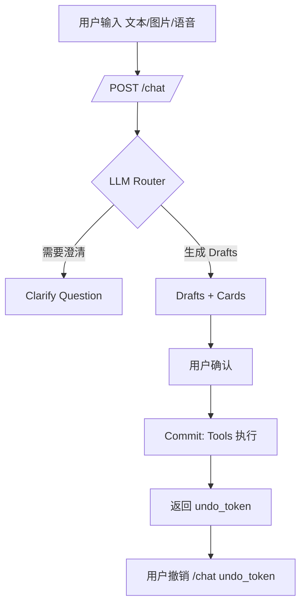

# SoloHandle AI Companion 项目文档

**Project Overview**
SoloHandle 是一个面向个人生活管理的 AI 助手系统，支持多端（移动端、Web）记录生活事件、任务与情绪，并通过 LLM 驱动的意图识别实现“草稿-确认-提交-撤销”的安全数据写入流程。核心价值在于：以更自然的输入（文本/图片/语音）帮助用户进行结构化记录，同时提供可追溯、可撤销的操作闭环，降低 AI 误操作风险，提升个人数据管理体验。

适用场景包括：日常记账、任务管理、情绪记录、生活日志以及可视化数据回顾。

**System Structure**
Monorepo 结构总览（重点路径）：

| 模块 | 位置 | 功能 | 主要输入 | 主要输出 | 依赖 |
|---|---|---|---|---|---|
| API 后端 | `apps/api` | FastAPI 服务、路由、业务逻辑、工具执行、LLM Router、Scheduler | HTTP 请求、LLM 返回 | JSON 响应、DB 写入 | SQLite、本地 config、OpenAI Compatible API |
| 移动端 | `apps/mobile` | Flutter App（Chat、Timeline、Tasks、Dashboard、Settings） | 用户输入、API 响应 | UI 展示与交互 | FastAPI、SharedPreferences |
| Web 端 | `apps/web` | 最小 Flutter Web UI | 用户输入、API 响应 | UI 展示与交互 | FastAPI |
| 协议与常量 | `packages/schemas`、`packages/constants` | JSON Schema & 业务常量枚举 | - | 统一协议与枚举 | 后端、前端、工具 |
| 提示词 | `packages/prompts` | LLM Router Prompt | 用户输入 | Router JSON | LLM Provider |
| 数据 | `data/app.db` | SQLite 数据库文件 | 业务写入 | 任务/事件/通知/日志 | API |
| 文档 | `docs` | 接口与架构说明 | - | 文档输出 | - |
| 脚本 | `scripts` | 调试、初始化、调度 | CLI | 测试输出 | API |
| 容器 | `docker` | Docker 构建与编排 | - | 运行环境 | Docker |

后端模块划分（`apps/api/src/api`）：

| 模块 | 位置 | 功能 | 输入 | 输出 | 依赖 |
|---|---|---|---|---|---|
| 路由 | `routes/*.py` | 对外 HTTP 接口 | HTTP 请求 | JSON | Service |
| Orchestrator | `services/orchestrator_service.py` | Draft/Confirm/Undo 机制 | Chat 请求 | Draft/Commit/Undo 结果 | Router、Tools、Repo |
| Router | `router/` | LLM 意图识别与结构化输出 | 文本/图片 | RouterDecision JSON | LLM Provider |
| Tools | `tools/*.py` | 事件/任务/通知执行层 | 结构化参数 | DB 写入结果 | Service、Repo |
| Services | `services/*.py` | 业务组合与校验 | 结构化参数 | 业务结果 | Repo、Core |
| Repositories | `repositories/*.py` | SQL CRUD | 业务参数 | DB 行 | SQLite |
| DB & Core | `db/connection.py`, `core/*` | 连接、校验、时间与常量 | - | 工具方法 | SQLite、constants |
| Scheduler | `scheduler/reminder_scheduler.py` | 定时提醒处理 | tasks.remind_at | notifications | DB |

**Key Data Model**
SQLite 表结构（核心字段）：

| 表名 | 关键字段 | 说明 |
|---|---|---|
| `events` | `type`, `data_json`, `happened_at`, `tags_json`, `source`, `confidence`, `idempotency_key`, `is_deleted` | 事件记录（expense/meal/mood/lifelog） |
| `tasks` | `title`, `status`, `priority`, `due_at`, `remind_at`, `reminded_at`, `notification_id`, `tags_json`, `note`, `idempotency_key`, `is_deleted` | 任务与提醒 |
| `notifications` | `task_id`, `title`, `content`, `scheduled_at`, `sent_at`, `read_at` | 通知记录 |
| `orchestrator_logs` | `kind`, `request_id`, `draft_id`, `tool_name`, `payload_json`, `result_json`, `undo_token` | Draft/Commit/Undo 日志 |

**Functional Description**
主要功能与用户交互流程：

1. 统一入口 `/chat`
草稿生成、确认提交、撤销的闭环流程。



2. 任务与提醒
任务可通过 `/chat` 生成草稿或直接用 `/tasks` 查询，支持完成、延期、删除与撤销。

3. 数据聚合与 Dashboard
`/api/dashboard/summary` 提供财务趋势、情绪趋势、任务打卡等数据汇总，供移动端 Dashboard 展示。

4. Scheduler
轮询 `tasks.remind_at`，到期后生成 `notifications` 并回写任务提醒状态。

**AI Interfaces**
对 AI 或外部系统的主要可调用接口如下：

| 接口 | 方法 | 说明 | 输入 | 输出 |
|---|---|---|---|---|
| `/chat` | POST | 统一入口（草稿/确认/撤销/编辑/任务操作） | `chat_request.schema.json` | `chat_response.schema.json` |
| `/events` | GET | 事件查询 | query/types/date_from/date_to | 分页事件列表 |
| `/tasks` | GET | 任务查询 | query/status/scope/date_from/date_to | 分页任务列表 |
| `/tasks/{id}/complete` | POST | 完成任务 | task_id | 任务对象 |
| `/router/health` | GET | Router 状态 | - | LLM 配置信息 |
| `/api/dashboard/summary` | GET | Dashboard 汇总 | tz | 汇总数据 |

Tool Schema（供 AI/外部系统结构化调用）：

`packages/schemas/tools/*.schema.json`  
包含 create_expense/create_task/create_mood 等全量工具入参定义。

**Technical Implementation**
后端技术栈：

| 类别 | 选择 | 说明 |
|---|---|---|
| 语言 | Python 3.11+ | FastAPI 服务 |
| 框架 | FastAPI, Uvicorn | API |
| LLM | OpenAI Compatible API | `config.toml` 驱动 |
| DB | SQLite | 轻量嵌入式存储 |

前端技术栈：

| 端 | 语言/框架 | 关键库 |
|---|---|---|
| Mobile | Flutter | Riverpod, Dio, GoRouter, Google Fonts |
| Web | Flutter Web | http, Google Fonts |

外部服务集成：

1. LLM Router：通过 `config.toml` 配置 `base_url/api_key/model`，兼容 OpenAI API 形态。  
2. 语音转写：使用 `OpenAICompatibleProvider.transcribe_audio()` 调用 Whisper 模型。  

**User Guide**
启动后端：

```bash
cd apps/api
$env:PYTHONPATH="src"; uv run uvicorn api.main:app --host 0.0.0.0 --port 8000 --reload
```

运行 Scheduler：

```bash
python scripts/run_scheduler.py
```

常用调试：

```bash
python scripts/debug_request.py chat "我今天花了25元买咖啡"
python scripts/debug_request.py confirm <draft_id>
python scripts/debug_request.py undo <undo_token>
```

注意：`debug_request.py` 默认 `base_url` 为 `http://127.0.0.1:7876`，需按实际端口调整。  

移动端配置：
在设置页配置 API Base URL（默认 `http://127.0.0.1:8000`），支持 Token 认证（若后端开启）。  

**AI Parsing Tips**
AI 在理解与调用该项目时建议关注：

1. 时间字段必须是带时区偏移的 ISO8601 字符串。默认时区来自 `packages/constants/constants.json`（当前为 `Asia/Shanghai`）。  
2. 所有写入工具应尽量提供 `idempotency_key` 以保证幂等。  
3. 枚举值严格受 `packages/constants/constants.json` 与 `packages/schemas/*.schema.json` 限制。  
4. `/chat` 返回可能包含 `need_clarification=true`，此时应引导用户补充信息，而非直接提交。  
5. `draft -> confirm -> commit -> undo` 是核心安全闭环，AI 或自动化系统应保留 `undo_token`。  

**Appendix: Key Files**

| 目的 | 文件 |
|---|---|
| API 入口与路由 | `apps/api/src/api/main.py` |
| /chat 接口 | `apps/api/src/api/routes/chat.py` |
| LLM Router | `apps/api/src/api/router/route.py` |
| LLM Provider | `apps/api/src/api/router/provider.py` |
| Orchestrator | `apps/api/src/api/services/orchestrator_service.py` |
| Tools | `apps/api/src/api/tools/` |
| SQLite schema | `apps/api/src/api/db/connection.py` |
| API 文档 | `docs/api.md` |
| Schema 文档 | `docs/schemas.md` |
